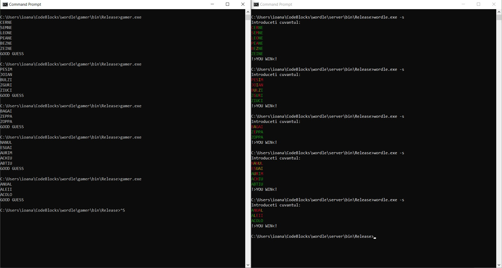

# Wordle Project

## Authors

- Ioana Potlog
- Bianca Alexandra Dogăreci
- Bianca Suciu

## Description
This client-server project tries to guess a word letter by letter within a limited number of attempts, using brute force approach. It contains two competing programs that communicate using shared memory (IPC). 

- The server takes a word from the dictionary (from the file `words.in`) and waits for the client's input
- The client makes a guess choosing a word from the same dictionary and sends it to the server 
- The server responds indicating letters that exist in the chosen word, either at the right position or not
- The client makes another guess by keeping letters in the right position, moving the wrongly placed letters in other positions and then looking for a similar word in the dictionary
- The client sends the new word to the server
- The cycle repeats until the word is guessed or the maximum number of attempts has been reached

## Screenshots

